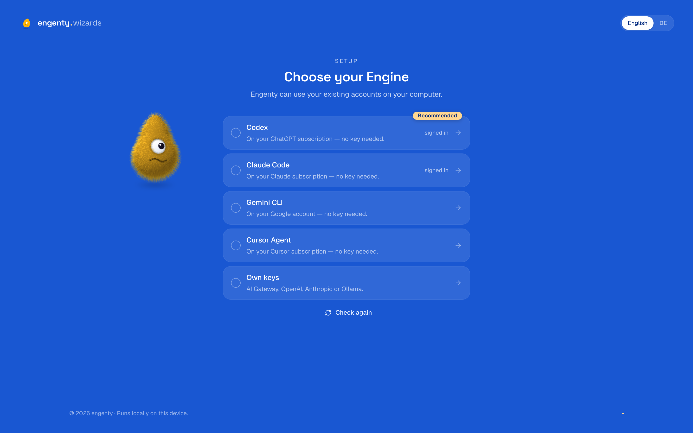

<p align="center">
  
</p>

<h1 align="center">engenty wizards</h1>

<p align="center">
  Make a wish. Get your wizard.<br>
  It guides you step by step.<br>
  Let AI do the work.
</p>

<p align="center">
  
</p>

## What it does

- **Describe it, get a wizard.** Say in plain words what you do again and again — a post with
  an image, a research briefing, an invoice, a quote, a damage report — and engenty builds a
  wizard for it: pages that ask what it needs, AI steps that do the work.
- **AI steps do the work.** They research the web, write, draw images, render video, read PDFs,
  scans and mails, build documents and dashboards, and write into other services over MCP, HTTP
  or a browser. Anything that changes an account asks first.
- **Share it with a link.** Anyone can run a wizard in the browser, on a phone too: camera,
  code scan, voice notes, location and a drawn signature included. Results download as PDF,
  Word, HTML, Markdown, PNG, MP4, CSV, Excel or JSON, or go out as a link.
- **Runs on your machine, on your subscription.** It thinks with Codex, Claude Code, Gemini CLI
  or Cursor Agent when one is installed and signed in, so no API key is needed. Or bring a key
  (Vercel AI Gateway, OpenAI, Anthropic), or a local model through Ollama. Your wizards and
  results stay in a folder on your machine.

## Install

On macOS or Linux, in a terminal:

```bash
curl -fsSL https://engenty.ai/wizards.sh | bash
```

It needs nothing but `curl` and asks for no password. It brings its own Node.js (a Node you
already have is left alone), installs engenty wizards into `~/.engenty/wizards` and then walks
you through the rest:

- **Something to think with.** It looks for Codex, Claude Code, Gemini CLI and Cursor Agent and
  offers to install one if there is none. Or use an API key or [Ollama](https://ollama.com).
- **Google Chrome and ffmpeg** (optional): Chrome for PDF and PNG exports and for steps that use
  a browser, ffmpeg for MP4 videos of animated widgets.
- **The Mac app** (optional): the studio in its own window and in the menu bar.

Then it starts and the studio opens in your browser. Later, start it with:

```bash
engenty-wizards
```

It runs while that terminal is open; Ctrl-C stops it. `engenty-wizards status` says what is
installed and what runs, `engenty-wizards setup` runs the guided setup again, and
`engenty-wizards --help` lists the rest.

### From source

You need Node.js 24.11 or newer and pnpm 10 (`corepack enable`).

```bash
git clone https://github.com/engenty/engenty-wizards.git
cd engenty-wizards
pnpm install
pnpm build
pnpm wizards
```

pnpm may list "Ignored build scripts" — that's expected, nothing to do.

Code steps (shell, Node, Python) run in a sandbox when Docker and the sandbox image are on the
machine; a checkout brings its own sandbox, the installed version has none yet.

## First start

The setup asks what engenty should think with. Pick an AI client that is installed on your
computer — engenty uses your existing subscription and signs it in for you in a terminal right
on the page — or enter your own keys. It stays until a test call works, then the studio opens.

Change it later under Settings.

## Using it

- **Make a wizard:** describe it in the studio's chat, or start from one of the starters.
  You see the steps as a diagram and can change any of them.
- **Run and share:** try it yourself, then share the link. Shared results are kept for 7 days
  for people without an account.
- **Connect services:** Gmail, Google Drive, Calendar, Contacts, Outlook, OneDrive, Slack,
  GitHub, HubSpot and S3 are built in; any other service can be added from its API description
  or MCP server through the [integrations.sh](https://integrations.sh) registry. Services that
  sign in with OAuth need a few settings first: [Connectors](docs/development.md#connectors).
- **Build from Claude Code or Codex:** Settings → "Build with Claude Code & co." creates a key
  and shows the command to add engenty wizards to your AI client.

Your machine only answers on `localhost`. To let others open shared wizards, run it on a server.

## Your data

Everything lives in `~/.engenty/wizards/data`: the databases and the files of your wizards and
results. Keys you enter are kept in the Keychain on a Mac, elsewhere encrypted in that folder.
Back up the folder; delete it to start over. The command line and the Mac app use the same
data. Settings go into `~/.engenty/wizards/.env` (see [.env.example](.env.example));
`ENGENTY_HOME` moves the whole install.

`pnpm start` in a checkout keeps its data in the `data` folder next to the code instead.

## Update

```bash
engenty-wizards update
```

This runs the installer again without its questions and updates the Mac app if it is installed.
From source: `git pull`, `pnpm install`, `pnpm build`. Your data is brought up to date at the
next start.

To remove engenty wizards, delete `~/.engenty/wizards` (your data is in its `data` folder) and
`~/.local/bin/engenty-wizards`.

## Run it on a server

With Docker, behind an https proxy (Caddy, Traefik, Coolify):

```bash
git clone https://github.com/engenty/engenty-wizards.git
cd engenty-wizards
cp .env.example .env    # set APP_URL to your https address and add a model key
docker compose up -d --build
docker compose logs     # shows the link to open once
```

Point the proxy at port 8891. On a server, engenty thinks with your keys or Ollama; the
AI clients' subscriptions live on your own computer. The code sandbox is off in this image.

## Mac app

The setup offers it; `engenty-wizards app` installs it later. It is a window on the same
install: it starts engenty wizards when you open it, keeps it running in the menu bar, and
stops it when you quit. It can also connect to your own server instead.

The app isn't signed with an Apple Developer ID yet, so it is not offered as a download: macOS
would block a copy that came through a browser. Installed by the command above it opens
normally.

## Troubleshooting

| | |
|---|---|
| "This link is no longer valid" | The link works once. `engenty-wizards open` gives this browser a new one. |
| `engenty-wizards`: command not found | Open a new terminal, or run `~/.local/bin/engenty-wizards`. |
| You open it under another address | Set `APP_URL` in `~/.engenty/wizards/.env` to the address you open. |
| An AI client shows as not signed in | Sign it in on the setup page, or in your own terminal (e.g. `claude`, `codex login`), then "Check again". |
| PDF or PNG export fails | Install Google Chrome, or set `CHROME_PATH` to Chrome or Chromium. |
| Port 24368 is taken | The next free port is used. To fix one, set `API_PORT` in `~/.engenty/wizards/.env`. |
| Something else | `engenty-wizards doctor` checks the install. |

More settings: [.env.example](.env.example).

## For developers

Development server, checks, how it is built, the managed mode and the desktop app:
[docs/development.md](docs/development.md).

## License

[FSL-1.1-MIT](LICENSE): use it for yourself and your company, run it, change it — just don't
offer it to others as a competing product or service. Each release becomes MIT two years
after it is published.
