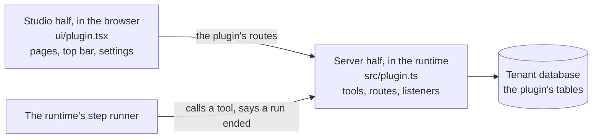

A plugin adds to a runtime without changing its code. The runtime finds plugins at start, loads
them from their files and loads one again when its files change.

## What a plugin can add

| It adds | Where it shows | Page |
|---|---|---|
| A tool for AI steps | In a step's tool list, in the assistant's and the MCP authoring guide | [Tools](./tools.md) |
| Routes | Below `/api/studio/plugins/<id>` | [Routes](./routes.md) |
| Tables | In every tenant's database | [Tables](./tables.md) |
| A listener on runs that end | Nowhere: it works in the background | [Run events](./events.md) |
| A page of the studio | Behind an icon in the top bar, or at its address | [The studio half](./studio.md) |
| A section of the settings | In the settings' list | [The studio half](./studio.md) |

## Two halves

| | Server half | Studio half |
|---|---|---|
| File | `src/plugin.ts`, or the one file a small plugin is | `ui/plugin.tsx`, built to `dist/client.js` and `dist/client.css` |
| Runs in | The runtime | The studio, after sign-in |
| Loaded | As TypeScript, no build | As the built script |
| Types | `@engenty-wizards/plugin-sdk` | `@engenty-wizards/plugin-sdk/studio` |
| Adds | Tools, routes, tables, listeners | Pages, icons in the top bar, sections of the settings |

A plugin has one half or both. The studio half talks to the server half over the plugin's own
routes.

## What a plugin may touch

A plugin runs inside the runtime's process with all of its rights. It reads every tenant's data,
the install's settings and the files of the machine. There is no sandbox and no permission list.

- Install only code you know.
- A plugin for others says in its own description what it reads and where it sends it.

## Not the Claude Code plugin

The "Claude Code plugin" of engenty wizards is something else: what a runtime hands to Claude
Code (`plugin/` in the repository). These pages are about plugins of the runtime.

## Not there yet

- Connectors, tools for MCP clients, AI clients and templates from a plugin.
- New kinds of steps or fields: the public pages of a wizard load no plugin.
- Building a studio half without a checkout of the repository.
