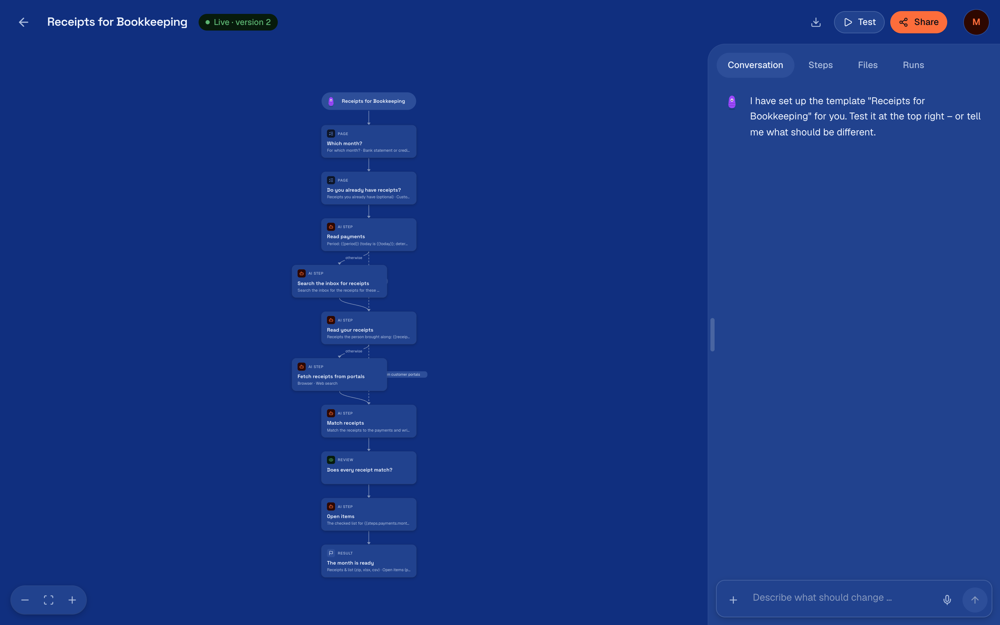

engenty wizards turns something you do again and again into a wizard: pages that ask what it
needs, AI steps that do the work, and a link to share. A post with an image, a research
briefing, an invoice, a quote, a damage report.

## What you do with it

| | |
|---|---|
| **Describe it** | Say in plain words what the wizard should do. The assistant builds the flow; you see it as a diagram and change any step. |
| **Let AI steps work** | They research the web, write, draw images, render video, read PDFs, scans and mails, build documents and dashboards, and write into other services. Anything that changes an account asks first. |
| **Share a link** | Anyone runs the wizard in a browser, on a phone too. Results download as PDF, Word, HTML, Markdown, PNG, MP4, CSV, Excel or JSON, or go out as a link. |
| **Keep it on your machine** | It thinks with Codex, Claude Code, Gemini CLI or Cursor Agent on your own subscription, with your own keys, or with a local model. Wizards and results stay in a folder on your computer. |

## Where to start

1. [Install](./install.md) it: one command on macOS or Linux.
2. At the [first start](./first-start.md), choose what it thinks with.
3. [Build a wizard](./build-a-wizard.md) from a sentence or a template.
4. [Test and share](./test-and-share.md) it.
5. Use it from your [AI apps](./ai-apps.md): Claude Desktop, Cursor, Codex and others.

## Words used here

| Word | Means |
|---|---|
| Studio | Where you build wizards: `/studio` of your install |
| Wizard | A flow of steps a person walks through on a link |
| Step | One part of the flow: a page, an AI step, a review, the result |
| Run | One person going through a wizard once |
| Project | What all your wizards know: name, logo, colours, facts, documents |
| Model class | The kind of model a step needs. Which model serves a class is a setting, not part of the wizard |

## Two places it runs

This guide describes the install on your own computer: there you build. engenty.ai is the cloud:
with an account, what you publish on your computer also runs there, behind a link that works
while your computer is off, on the account's credits. The studio at engenty.ai shows those
wizards and their runs and changes nothing ([Test and share](./test-and-share.md#in-the-cloud)).
