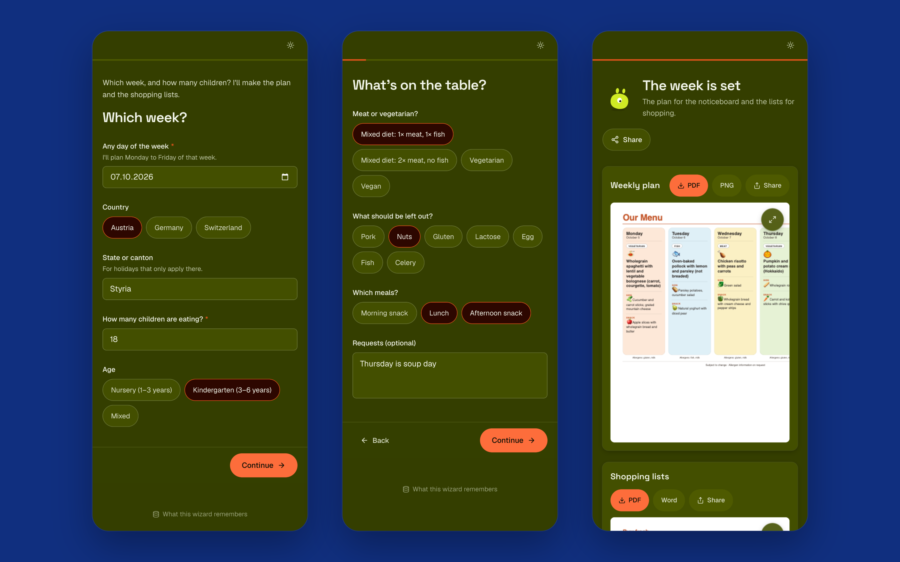

## From the link to the result

1. The link opens the wizard. "Let's go" starts a run.
2. Pages ask their questions. "Continue" goes on, "Back" returns.
3. While an AI step works, the page says what it is doing. The screen stays on.
4. A review shows what was made: "Looks good" accepts it, "New version" asks for another with a
   note on what should change, "Edit" changes a text by hand.
5. The result page offers the downloads, "Copy text" and "Share".

A run that was left can be picked up again: "Continue your last run".

## As a chat

Where the owner switched it on, the wizard also runs as a chat, at `…/chat` or straight on its
link: it asks one question at a time, answers come from the composer or the replies under the
question, and every answer stays in the thread. Two buttons sit in the composer:

| Button | Does |
|---|---|
| Speaker | Reads what the wizard says aloud, with the browser's own voice in the wizard's language. Costs nothing, stays on in this browser |
| Microphone (⌘⇧M, Ctrl⇧M on Windows) | Dictates into the composer. The browser writes along where it can recognise speech; elsewhere the recording is written down by the wizard's own model when you stop, like a voice note |
| Phone | A live conversation: you talk, the wizard talks back and fills its pages from what you say, one question at a time. Photos, files and signatures stay on the screen; the wizard says so. At `…/talk` the conversation is offered first. Only where the owner switched it on |

## On a phone

| The wizard asks for | The phone gives |
|---|---|
| Photos | The camera, page after page, or pictures from the library |
| A paper | The camera as a scanner |
| A short clip | The camera, up to 30 seconds |
| A serial or ticket number | "Scan" reads a QR code or barcode |
| Where you are | "Use my location", with its accuracy. An address can be typed instead |
| What happened | "Record a voice note", up to 5 minutes |
| A sign-off | "Sign here", with a finger |

The browser asks before it uses the camera, the microphone or the location. If one was denied,
allow it in the browser's site settings (the lock icon in the address bar), or use the fallback
the field offers: choose a photo, type the address, pick an audio file.

"Tell me when it is done" lets you switch apps during a long step: a notification, a sound or a
buzz brings you back. "Add to home screen" puts the wizard on the phone like an app.

## When the wizard needs you

| It shows | Because | You |
|---|---|---|
| A sign-in in a picture of a website | A step met a login | Type into the page. What you enter goes straight into the page; the AI never sees it. "Remember this sign-in for next time" stores it encrypted. "Skip" goes on without the site |
| "The wizard wants to run this in …" | A step wants to change something in a service you connected | "Allow", "Allow for the rest of this run" or "Don't allow". Reading does not ask; deleting always does |
| "Connect" | The wizard works with your own account of a service | Sign in to the service in a new tab. The connection is kept for your next run |

## What this wizard remembers

A wizard can keep lists, files and connected accounts for your next run. Only you see them.
The link "What this wizard remembers" below the wizard's pages shows what is kept and deletes
everything on request. What nobody used for 400 days is deleted by itself.

## Share a result

"Share" on the result page makes a link to the result, sends it by e-mail or hands it to
another app. The result and its link are kept for 7 days. "Withdraw link" ends the link earlier.

Media a model made carries an "AI generated" label. Whoever publishes it has to label it as
AI-generated; the file already carries the marking.
